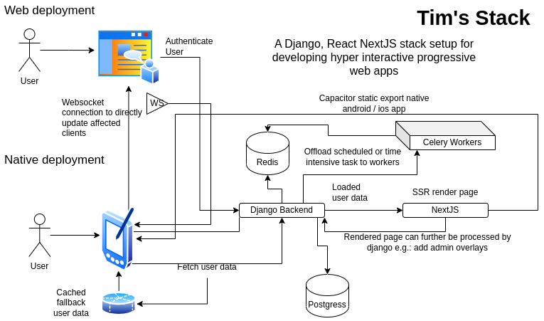

# Tim's Stack Bunnyshell Template

> **This is the Helm Version, and can only be deployed on private kubernetes clusters**, use the compose version to deploy on the bunnyshell cluster

### Formal Overview

## Use Case

This stack is designed for dynamic real-time web apps with mobile clients.
Backend changes can be directly sent to clients using a live WebSocket connection,
state in the client is managed with Redux.
This allows automatically updating all affected clients on any backend changes.

For the web-application setting, the Django backend dynamically requests Next.js pages,
this includes dynamic page data so we get full SSR for all pages.

The Next.js frontend is integrated with Capacitor and directly exports to Android and iOS.
In a native setting, the frontend will try to request user data from the backend,
if it fails it can fallback to a cached version allowing the user to view the full state of the app in an 'offline' mode.

## Stack Components

- Next.js + React frontend (deployment)
    - Tailwind CSS + DaisyUI
    - Automatic platform adjustments for API calls, authentication, and native functions (my custom implementation)
    - Global Redis store + auto background update WebSocket
    - Capacitor setup for native integrations and iOS / Android PWA export

- Django backend (deployment)
    - Celery for task management (or for offloading time-intensive tasks)
    - Django REST Framework + django_rest_dataclasses for rapid REST API development
    - Django proxy for authenticating views on other pods like the docs
    - DRF Spectacular for auto-generated API documentation
    - Django Channels for managing WebSockets and sending updates to clients

- Documentation (deployment)
    - pdoc3 code documentation generated from backend code

- PostgreSQL (helm chart)
    - Main backend database

- Redis (helm chart)
    - Broker for Celery
    - Database for Django Channels

This stack template utilizes `Generic Components` for image builds, which enables the usage of the same `Makefile` for local development.

Images are pushed to a private GitHub container registry, and the cluster is automatically configured to authorize pulling these images using a fine-grained GitHub access token.

For a detailed overview of the stack, please review the [root README of the stack repository](https://github.com/tbscode/tims-stack-anystack/blob/main/README.md).

## Setup:

> NOTE: This setup automatically triggers the build workflows in your GitHub account and authenticates the cluster to pull your images using your GitHub token. An [alternative template](../../../.bunnyshell/templates/tims-stack-django-nextjs-static/README.md) is available, which includes prebuilt static images that should also work on the Bunnyshell cluster. This does not require adding a GitHub access token to the environment variables.

1. Fork the root repository.
2. Log in to Bunnyshell using GitHub.
3. Generate a fine-grained GitHub token with permissions to access the repository and write packages (`Settings > Developer Settings > Fine-grained Access Token`).

## Bunnyshell Components

These are the global stack components. Please note that individual implementations are also heavily customized for rapid API and consumer development. Refer to the repository README for more information.

### Image Manager (`image-manager`)

This component connects to a GitHub account using an access token (ideally, a fine-grained GitHub token with access **only** to the forked repository and read/write package permissions). This token will also be automatically configured with your cluster to authorize pulling the images from your private GitHub registry.

**Deploying** this container automatically triggers a GitHub workflow to build your images and push them to your GitHub registry. The container will wait for the GitHub actions to complete by polling the workflow APIs and will raise an error if any build fails.

**Destroying** this container automatically deletes the images from your registry.

### Database (`postgres`)

A simple PostgreSQL database is provided to automatically connect to the Django backend. The backend will automatically populate this database with test users.

### Redis (`redis`)

A simple Redis server is included for Celery worker communication and WebSocket channel communication. This is required for horizontal scaling of backend containers without concurrency issues.

### Backend (`backend`)

This is the core of the application: a horizontally scalable Django container that manages the entire application state and communication.

This component is part of the Helm chart used for deploying the backend and is configured with [these components](TODO).

All components [use open-source licenses]().

**Stopping** this component will decrease pods to 0, while starting will increase pods to 2, enabling concurrent testing of tasks and Celery workers.

### Frontend (`frontend`)

This is a horizontally scalable React, Next.js, and Capacitor setup. In a web context, the backend dynamically requests rendered pages with preloaded user data. Custom scripts and Capacitor integration enable the exporting of this component as a static app and building for Android and iOS. Other Capacitor plugins can also interact with native functions.

Numerous custom implementations are present for managing application state, cache fallback data, and WebSocket connections. [Please click here for further information]().